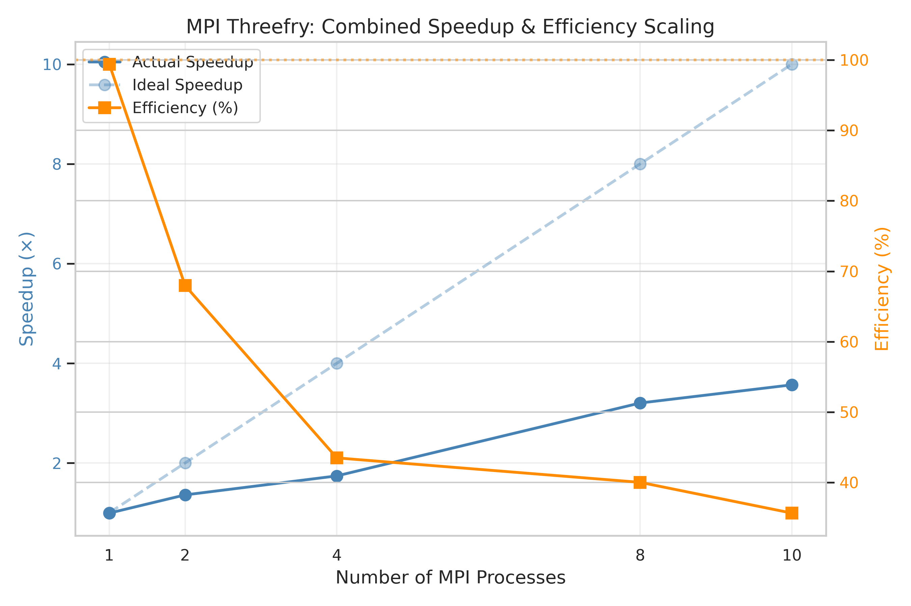
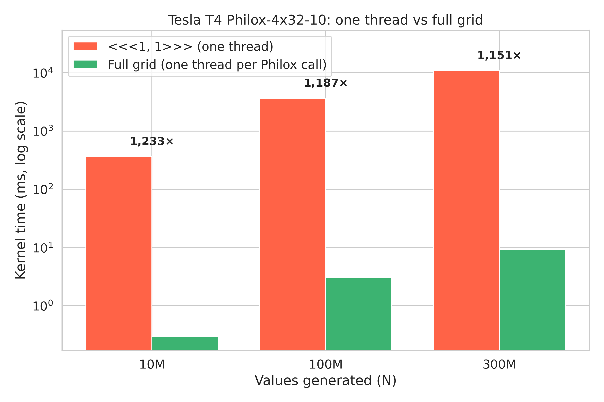
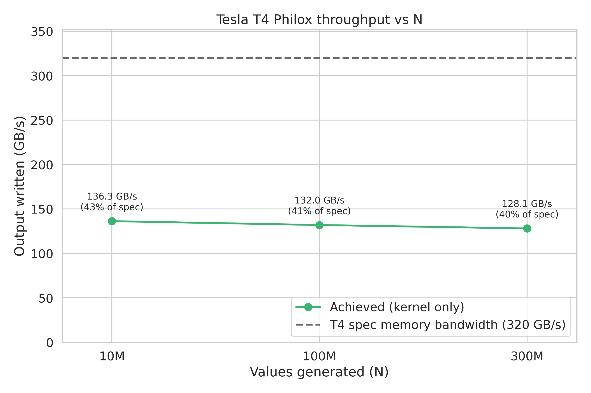
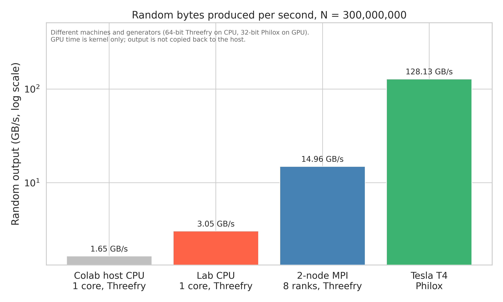

# MPI-PRNGs

Parallel random number generation with the counter-based generators from
Salmon et al., *"Parallel Random Numbers: As Easy as 1, 2, 3"* (SC11,
[doi:10.1145/2063384.2063405](https://doi.org/10.1145/2063384.2063405)),
scaled across a two-machine MPI cluster and a CUDA GPU.

Built for CS-3006 Parallel and Distributed Computing (Spring 2026) by
Mahad Malik and Rayyan Imran.

## The idea

A conventional generator like Mersenne Twister is a state machine: value *k*
depends on value *k − 1*, so splitting the work across processes means either
sharing state or carefully jumping ahead. Threefry and Philox, from the
[Random123](https://github.com/DEShawResearch/random123) library, are instead
keyed bijections:

```
output = threefry4x64(counter, key)
```

There is no state to carry, so any process can compute any slice of the
sequence on its own. This project measures how far that property actually
gets you on real hardware.

## What is implemented

| Program | What it does |
|---|---|
| `baseline/sequential_threefry.cpp` | Threefry-4x64-20 on one core, averaged over 5 runs. MPI speedups are relative to this time. |
| `cpu_parallel/mpi_threefry.cpp` | Same generator split across MPI ranks. Each rank uses key `(rank, seed, 0, 0)` and counter = global output index, so ranks never exchange data. The only MPI calls are one `MPI_Barrier` before timing and one `MPI_Reduce(MPI_MAX)` of per-rank times afterwards. |
| `gpu_parallel/cuda_philox.cu` | Philox-4x32-10 with one CUDA thread per Philox call (4 outputs each), in a grid-stride loop. Its speedup is measured against the same kernel launched as `<<<1, 1>>>` on the same GPU, so CPU-vs-GPU hardware differences don't inflate the number. |
| `hardware_profiling/bandwidth_test.cpp` | Read, write and copy bandwidth over 512 MB arrays, plus an FMA throughput ceiling, used to place the generators on a roofline. |
| `hardware_profiling/roofline_analysis.cpp` | Combines every CSV in `results/` into `results/final_analysis.txt`. |
| `plots/generate_plots.py` | Turns the CSVs into the CPU/MPI figures below. |
| `plots/generate_gpu_plots.py` | Builds the T4 figures from `results/gpu_results_t4_sweep.csv`. |

Every generated value is written to memory, so the benchmarks measure
producing a usable buffer of random numbers, not just running the cipher.

## Cluster setup

The multi-node runs used two lab machines on the same subnet over TCP:
`localhost` (8 slots) and a second machine (10 slots). They had OpenMPI
packages that reported the same version but used incompatible PMIx/ORTE builds,
so `make deploy-mpi-runtime` copies the local source-built OpenMPI to the
remote host and wraps `orted` so both ends run identical runtimes. Each host
runs its own binary through an MPI appfile, and rank 0 is always local, so
results land in the local `results/` directory.

## Results

N = 300,000,000 64-bit values (2.4 GB of output) per run. The single-core
baseline takes **0.786 s (3.05 GB/s)**.

**Across both machines** (ranks split evenly, except the 18-rank run, which is 8 local + 10 remote):

| Ranks | Split | Wall time (s) | Throughput (GB/s) | Speedup | Efficiency |
|---:|---|---:|---:|---:|---:|
| 2 | 1 + 1 | 0.426 | 5.64 | 1.85× | 92% |
| 4 | 2 + 2 | 0.261 | 9.21 | 3.02× | 75% |
| 8 | 4 + 4 | 0.160 | 14.96 | **4.90×** | 61% |
| 16 | 8 + 8 | 0.162 | 14.84 | 4.86× | 30% |
| 18 | 8 + 10 | 0.200 | 12.01 | 3.94× | 22% |

**Second machine on its own:**

| Ranks | Wall time (s) | Throughput (GB/s) |
|---:|---:|---:|
| 1 | 0.661 | 3.63 |
| 2 | 0.356 | 6.74 |
| 4 | 0.265 | 9.06 |
| 8 | 0.192 | 12.53 |
| 10 | 0.195 | 12.28 |



### Reading the numbers

**Scaling stops at memory bandwidth, not communication.** Generation involves
no messages, so the drop in efficiency can't come from MPI traffic. At 8 ranks
each machine is writing about 7.5 GB/s of output. The local machine's measured
write bandwidth is 7.82 GB/s, so it is already at 96% of its ceiling. Wall time
is the slowest rank's time (`MPI_MAX`), so that one saturated machine sets the
pace for the whole run. Going from 8 to 16 ranks adds cores but no bandwidth,
and throughput stays flat (14.96 → 14.84 GB/s). The standalone runs on the
second machine flatten the same way, at about 12.5 GB/s from 8 ranks on.

**18 ranks is slower than 16** (3.94× vs 4.86×). That is the only run with an
uneven split (8 + 10), and the second machine there writes only about 6.7 GB/s,
well under its 10.8 GB/s ceiling. We didn't isolate the cause. Oversubscribing
the second machine's physical cores is the first thing to check.

**The roofline's compute ceiling is too low.** `bandwidth_test` measures peak
compute with scalar, dependent FMA chains at `-O2`, which gives 5.76 GFLOPS
locally. By that ceiling the single-core baseline would be at 132% of peak, so
the "compute-bound" label that `roofline_analysis` prints for Threefry
shouldn't be taken at face value. The write-bandwidth numbers above explain
the scaling better.

### GPU: Tesla T4

`cuda_philox.cu` was run on a Tesla T4 (40 SMs, Google Colab) at three sizes.
The notebook is in
[`gpu_parallel/t4_colab_run.ipynb`](parallel_rng_project/gpu_parallel/t4_colab_run.ipynb),
and the data is in
[`results/gpu_results_t4_sweep.csv`](parallel_rng_project/results/gpu_results_t4_sweep.csv).

| N | 1 thread (ms) | Full grid (ms) | CUDA threads | Throughput (GB/s) | Speedup vs 1 thread |
|---:|---:|---:|---:|---:|---:|
| 10M | 361.7 | 0.293 | 2,500,096 | 136.3 | 1,233× |
| 100M | 3,598.3 | 3.031 | 25,000,192 | 132.0 | 1,187× |
| 300M | 10,781.7 | 9.365 | 75,000,064 | 128.1 | 1,151× |



The speedup compares the same kernel on the same GPU with one thread and with
one thread per Philox call, so it measures parallelism alone. A single GPU
thread is far slower than a CPU core (0.11 GB/s against the lab CPU's 3.05 GB/s),
so this number is not a GPU-vs-CPU comparison.



Throughput is flat at 128–136 GB/s across a 30× range of N, which is 40–43%
of the T4's 320 GB/s spec bandwidth. Nsight Compute on the 300M run
([`results/gpu_t4_ncu_roofline.txt`](parallel_rng_project/results/gpu_t4_ncu_roofline.txt))
shows DRAM 76% busy against 43% for the SMs and classifies the kernel as
memory-bound. That's the same limit as the CPU cluster: Philox's ten rounds
cost less than storing the result. The profiled build is a slightly simplified
copy of the kernel with a single launch, so its 7.07 ms duration isn't directly
comparable to the 9.37 ms average above.



For scale, at N = 300M the T4 writes random output about 8.6× faster than the
best two-node MPI run, and 42× faster than one lab CPU core. These are rates of
random bytes produced, not speedups of one implementation over another. The
generators differ (64-bit Threefry on CPU, 32-bit Philox on GPU), the hardware
differs, and the GPU time is kernel-only: the 1.2 GB result stays in device
memory, while the CPU programs write to host RAM. The Colab host's own CPU
manages 1.65 GB/s on one core, about half the lab machine's speed.

The full generated report is in
[`parallel_rng_project/results/final_analysis.txt`](parallel_rng_project/results/final_analysis.txt).

## Building and running

Requirements: g++ with C++17, OpenMPI, Python 3 with `numpy pandas matplotlib
seaborn`, and optionally the CUDA toolkit. Random123 is header-only and
included as a submodule.

```bash
git clone --recurse-submodules https://github.com/Mahad1090/MPI-PRNGs.git
cd MPI-PRNGs/parallel_rng_project

make compile        # baseline, MPI, profiling tools
make run            # baseline → MPI 1/2/4/8/10 → bandwidth → report → plots
make run-mpi-4 N=50000000   # any target accepts N= and SEED=
make run-gpu        # needs nvcc and a CUDA GPU
python3 plots/generate_gpu_plots.py
```

Always run from `parallel_rng_project/`: the programs read and write
`results/` relative to the current directory, and the MPI and GPU programs
read the baseline time from `results/baseline_results.csv`, so the baseline
has to run first.

For the two-machine runs, set `REMOTE_USER`, `REMOTE_HOST`, the slot counts and
`MPI_IF_INCLUDE` at the top of the `Makefile`, then:

```bash
make remote-compile   # copy sources + OpenMPI runtime to the remote, build there
make run-remote       # 2/4/8/16/18-rank runs, remote profiling, report, plots
```

`make help` lists every target. `run_all_experiments.sh` is a single-machine
alternative to `make run` that keeps going when a step fails and prints a
pass/fail summary.

## Layout

```
parallel_rng_project/
├── baseline/            single-core Threefry
├── cpu_parallel/        MPI Threefry
├── gpu_parallel/        CUDA Philox
├── hardware_profiling/  bandwidth test + report generator
├── plots/               plotting script and generated figures
├── results/             CSVs from the runs above
├── random123/           Random123 headers (submodule)
├── Makefile
└── run_all_experiments.sh
```

## License

Apache 2.0, see [LICENSE](LICENSE).
